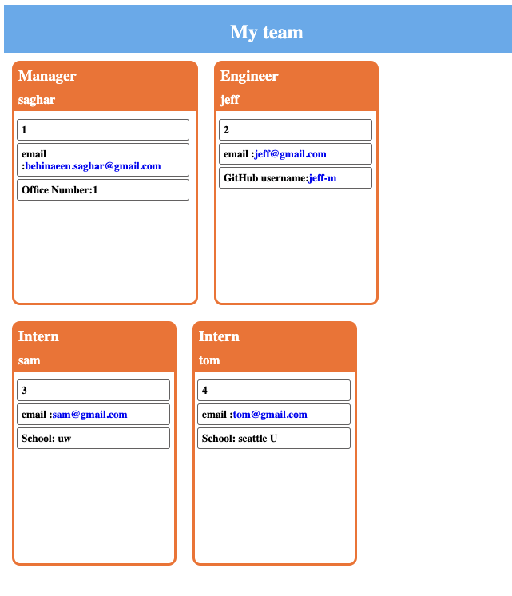

# 10 Object-Oriented Programming: Team Profile Generator

### Saghar Behinaein

## Your Task

Your task is to build a Node.js command-line application that takes in information about employees on a software engineering team, then generates an HTML webpage that displays summaries for each person. Testing is key to making code maintainable, so you’ll also write a unit test for every part of your code and ensure that it passes each test.

Because this application won’t be deployed, you’ll need to provide a link to a walkthrough video that demonstrates its functionality and all of the tests passing. You’ll need to submit a link to the video AND add it to the readme of your project.

> **Note**: There is no starter code for this assignment.

## User Story

```md
AS A manager
I WANT to generate a webpage that displays my team's basic info
SO THAT I have quick access to their emails and GitHub profiles
```

## Installation
Here are some guidelines to help you get started:

1. Clone the project in your laptop  
2. make sure you installed Node on your visual studio 
3.  Run the `npm init -y` comand in your terminal (your can see _package.json_ file in your folder)
4.  Run `npm install inquirer` comand in your terminal to get all the libraries 5.run the `node index.js` 
5.  answer all the questions now and team.html file will creat.  
   

you can see demo video in the link below:  
[demo Video](https://drive.google.com/file/d/1pi2Lx3bR_VDXAyEXCjd2zPcD1bAYniGH/view)


## My work
* command-line application that accepts user input
* start the application and then it ask you to enter the team manager’s name, employee ID, email address, and office number
* Then with a menu with the option to add an engineer or an intern or to finish building my team will show up
* By selecting the engineer option, then it prompted to enter the engineer’s name, ID, email, and GitHub username, and it taken back to the menu
* By selecting the intern option, then it prompted to enter the intern’s name, ID, email, and school, and it taken back to the menu
* By selecting finish building my team, it stop the questions and show a table of employee information and creat a team.html file that it open in browser with all the information


## test

The following image shows a mock-up of the generated HTML’s appearance and functionality:
* it passes all the test


* answe all the manager questions and select engineer or Intern questions


* quit in the end


* all the information will shod on the console and creat the team.html file



